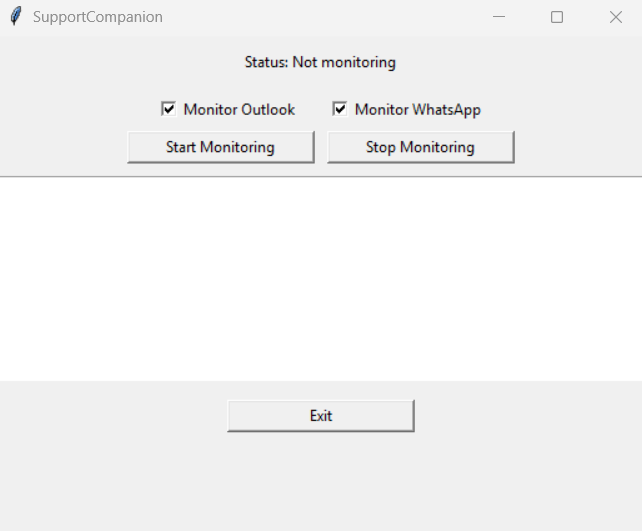

# ShiftAlert Assistant

A Python-based automation tool designed for night-shift operators. It monitors unread Outlook emails and WhatsApp Web messages, plays an audible alarm, and prevents the computer from sleeping.

## 🚀 Features
- Outlook shared inbox monitoring
- WhatsApp Web monitoring via Selenium
- Alarm sound (looped) until manually stopped
- Prevents system from sleeping
- GUI with real-time status and logs
- Optional toggles to monitor Outlook and WhatsApp independently

## 📸 Screenshot


## 🛠 Requirements

Install dependencies using:
```bash
pip install -r requirements.txt
